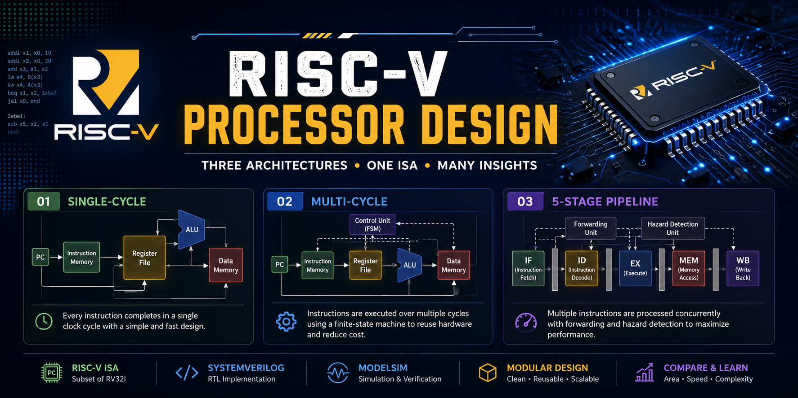
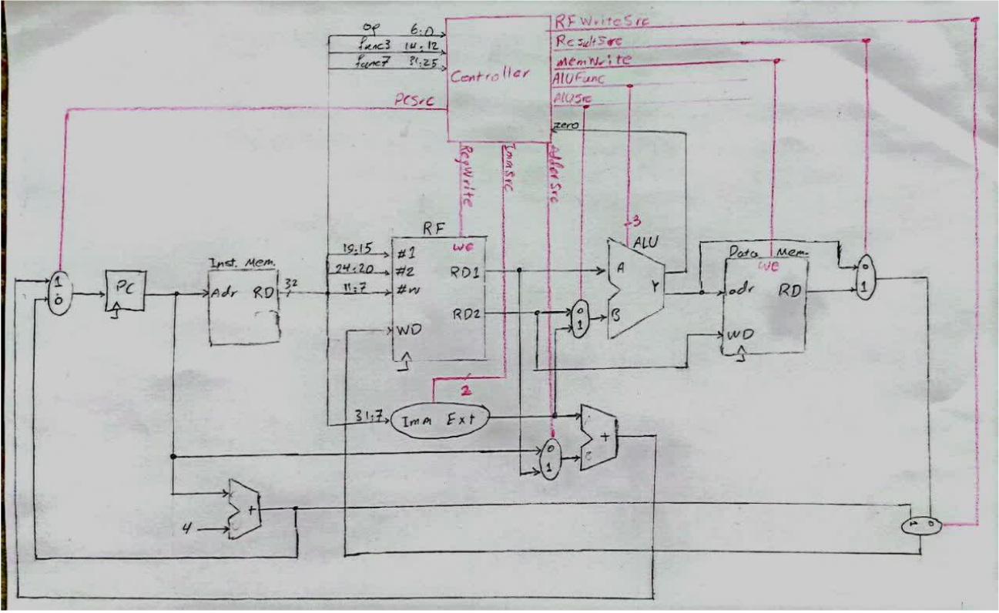
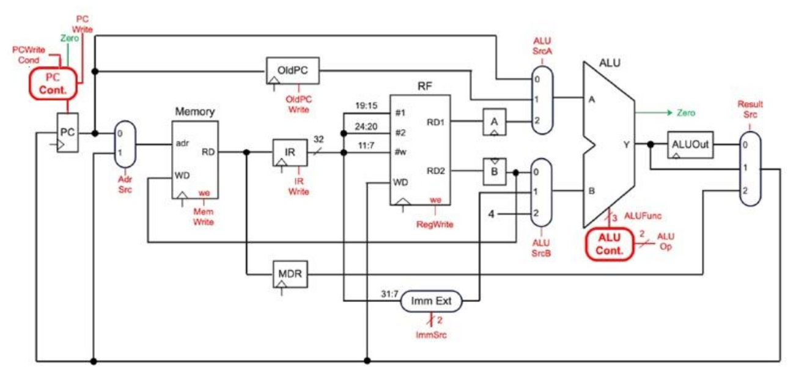
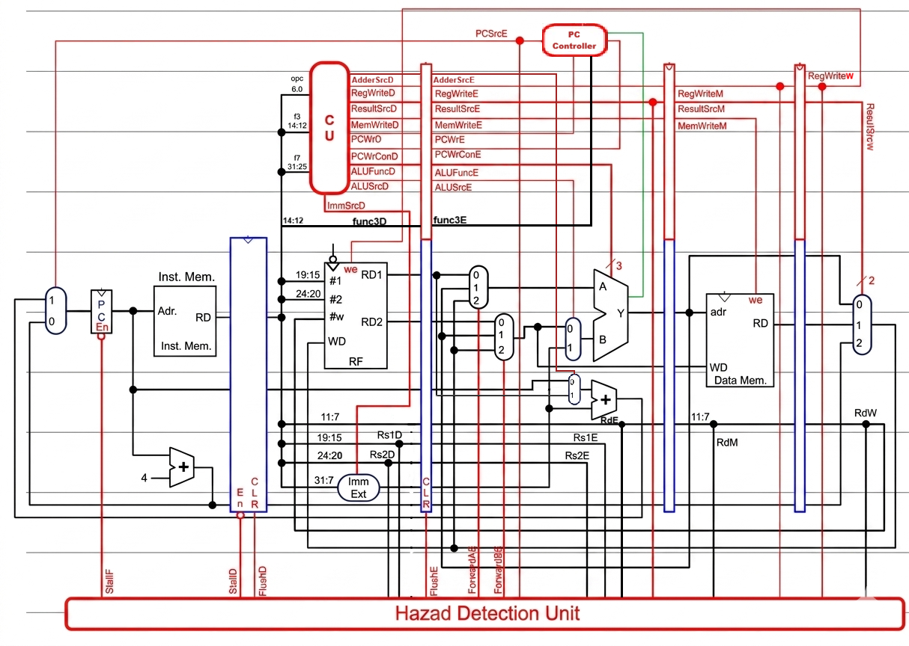

````markdown
<div align="center">

# RISC-V Processor Design



<br>


Implementation of a **RISC-V Processor** in **SystemVerilog** featuring **Single-Cycle**, **Multi-Cycle**, and **5-Stage Pipeline** architectures with simulation support using **ModelSim**.

</div>

---

# Overview

This repository presents the implementation of a **RISC-V Processor** developed as part of a **Computer Architecture** course project.

Instead of implementing only one processor architecture, this project includes **three different processor organizations**, allowing a direct comparison between their design philosophies, control logic, hardware complexity, and execution models.

The implemented architectures are:

- Single-Cycle Processor
- Multi-Cycle Processor
- 5-Stage Pipeline Processor

Each implementation is organized in an independent directory and can be simulated separately using **ModelSim**.

> **Note**
>
> This repository is intended to provide a clean overview of the project and its implementations.
> For detailed design decisions, datapath explanations, controller design, state machines, hazard handling, implementation details, and hardware analysis, please refer to the comprehensive reports available in the **`docs/`** directory.

---

# Repository Contents

| Architecture | Description |
|--------------|-------------|
| Single-Cycle | Executes every instruction in a single clock cycle. |
| Multi-Cycle | Reduces hardware cost by executing instructions across multiple clock cycles using a finite-state controller. |
| 5-Stage Pipeline | Improves performance through instruction pipelining with forwarding and hazard detection mechanisms. |

---

# Implemented Instruction Set

The processor supports the following subset of the **RISC-V ISA**.

| Instruction Type | Supported Instructions |
|------------------|------------------------|
| **R-Type** | `add`, `sub`, `and`, `or`, `slt` |
| **I-Type** | `lw`, `addi`, `xori`, `ori`, `slti`, `jalr` |
| **S-Type** | `sw` |
| **B-Type** | `beq`, `bne`, `blt`, `bge` |
| **J-Type** | `jal` |

---

# Key Features

- Three independent RISC-V processor implementations
- SystemVerilog-based hardware description
- Modular processor design
- Separate datapath and control unit implementation
- Single-Cycle architecture
- Multi-Cycle architecture with FSM-based control
- 5-Stage Pipeline implementation
- Data forwarding support
- Hazard Detection Unit (HDU)
- Branch and jump instruction support
- ModelSim simulation
- Memory-based program execution
- Validation using a sorting program
- Comprehensive technical documentation

---

# Validation

The processor implementations have been validated by executing a **sorting program** that sorts an array of **ten signed 32-bit integers** stored in memory.

This validation verifies the correct execution of arithmetic, logical, memory-access, branch, and jump instructions across all three processor architectures.

---

# Project Structure

```text
riscv-processor-design
│
├── single-cycle/
│   ├── *.sv
│   └── Testbench
│
├── multi-cycle/
│   ├── *.sv
│   └── Testbench
│
├── pipeline/
│   ├── *.sv
│   └── Testbench
│
├── docs/
│   ├── single-cycle-report.pdf
│   ├── multi-cycle-report.pdf
│   └── pipeline-report.pdf
│
├── images/
│   ├── banner.png
│   ├── overview.png
│   ├── architecture-single-cycle.png
│   ├── architecture-multi-cycle.png
│   └── architecture-pipeline.png
│
├── LICENSE
├── .gitignore
└── README.md
````

---

# Repository Organization

Each processor architecture is implemented independently.

This organization allows each implementation to be studied, simulated, and extended without affecting the others while also making architectural comparisons straightforward.

The repository documentation is divided into two parts:

* **README** provides a high-level overview of the project.
* **Technical Reports** inside the **`docs/`** directory contain the complete implementation details, including datapath design, control logic, hardware modules, controller implementation, pipeline organization, hazard handling, design decisions, and simulation explanations.

```
```
```markdown
---

# Processor Architectures

This repository contains three independent implementations of the same RISC-V processor, each representing a different CPU organization commonly studied in computer architecture.

Although all implementations execute the same instruction set, they differ significantly in hardware organization, control strategy, execution model, and performance characteristics.

| Architecture | Characteristics |
|-------------|-----------------|
| **Single-Cycle** | Executes every instruction in a single clock cycle using a purely combinational control unit. |
| **Multi-Cycle** | Reuses hardware resources across multiple cycles through a finite-state controller, reducing hardware cost while increasing execution latency. |
| **5-Stage Pipeline** | Executes multiple instructions concurrently using pipelining, forwarding, and hazard detection to improve overall throughput. |

---

# Architecture Overview

<p align="center">

</p>

The figure above illustrates the relationship between the three processor implementations included in this repository.

Each implementation follows the same instruction set while adopting a different architectural approach for instruction execution.

---

# Single-Cycle Architecture

<p align="center">

</p>

The Single-Cycle implementation executes every instruction within a single clock cycle.

Its straightforward datapath and control logic make it suitable for understanding the fundamentals of processor design and instruction execution.

---

# Multi-Cycle Architecture

<p align="center">

</p>

The Multi-Cycle processor divides instruction execution into multiple stages, allowing hardware resources such as the ALU and memory interface to be reused across several clock cycles.

This architecture significantly reduces hardware complexity compared to the Single-Cycle implementation while introducing a finite-state control mechanism.

---

# 5-Stage Pipeline Architecture

<p align="center">

</p>

The Pipeline implementation increases processor throughput by overlapping instruction execution across five pipeline stages:

- Instruction Fetch (IF)
- Instruction Decode (ID)
- Execute (EX)
- Memory Access (MEM)
- Write Back (WB)

To correctly support concurrent instruction execution, the processor incorporates forwarding paths and hazard detection mechanisms.

---

# Technologies

The project was implemented using the following technologies.

| Category | Technology |
|----------|------------|
| Hardware Description Language | SystemVerilog |
| Processor Architecture | RISC-V |
| Processor Models | Single-Cycle, Multi-Cycle, 5-Stage Pipeline |
| Simulation | ModelSim |
| Digital Design | RTL Design |
| Development Style | Modular Hardware Design |

---

# Running the Project

Each processor implementation is self-contained and can be simulated independently.

1. Open the desired architecture directory.
2. Compile all SystemVerilog source files.
3. Compile the corresponding testbench.
4. Start the simulation using ModelSim.
5. Run the simulation until program completion.
6. Observe the processor behavior and memory contents.

Each architecture contains its own implementation and testbench, allowing independent simulation without additional configuration.

---

# Validation Program

To validate the correctness of the implementations, all processors were tested using the same application program.

The validation program sorts an array of **ten signed 32-bit integers** stored in memory.

This program exercises different instruction categories, including:

- Arithmetic instructions
- Logical instructions
- Immediate operations
- Memory accesses
- Conditional branches
- Jump instructions

Successful execution of the sorting program demonstrates the functional correctness of the processor implementations.

---

# Technical Documentation

This README intentionally focuses on providing an overview of the project.

The complete implementation details are documented separately inside the **`docs/`** directory.

The reports include detailed explanations of:

- Datapath design
- Control Unit implementation
- ALU design
- Immediate Generator
- Memory organization
- Pipeline registers
- Forwarding Unit
- Hazard Detection Unit
- Finite-State Machine (Multi-Cycle)
- Pipeline control logic
- Design decisions
- Simulation methodology

Readers interested in the hardware implementation are encouraged to consult the corresponding report for each processor architecture.
```
```markdown
---

# Design Highlights

The project was developed with a strong emphasis on modularity, readability, and architectural comparison.

Some of the main design characteristics include:

- Independent implementations for each processor architecture
- Modular hardware components
- Separated datapath and control logic
- Reusable hardware modules across implementations
- Clear organization of source files
- Consistent naming conventions
- Architecture-specific testbenches
- Incremental architectural evolution from Single-Cycle to Pipeline

Rather than focusing only on functionality, the project also demonstrates how processor organizations evolve to improve hardware utilization and execution performance.

---

# Future Improvements

Possible future extensions include:

- Full RV32I instruction set support
- Multiply and divide instructions (M Extension)
- CSR instruction support
- Exception and interrupt handling
- Branch prediction
- Instruction and data caches
- Performance benchmarking
- Automated simulation scripts
- FPGA deployment
- Continuous Integration (CI)

---

# Repository Layout

The repository is organized so that each processor architecture can be explored independently.

| Directory | Purpose |
|-----------|---------|
| `single-cycle/` | SystemVerilog implementation and testbench of the Single-Cycle processor |
| `multi-cycle/` | SystemVerilog implementation and testbench of the Multi-Cycle processor |
| `pipeline/` | SystemVerilog implementation and testbench of the 5-Stage Pipeline processor |
| `docs/` | Detailed implementation reports for all processor architectures |
| `images/` | Images used throughout the documentation |

This structure keeps the project clean while making comparisons between the three implementations straightforward.

---

# Why Three Implementations?

Implementing multiple processor organizations provides valuable insight into processor design trade-offs.

| Architecture | Main Objective |
|--------------|----------------|
| Single-Cycle | Simplicity and understanding of the complete datapath |
| Multi-Cycle | Hardware resource sharing and reduced implementation cost |
| Pipeline | Higher instruction throughput and improved processor performance |

Although all implementations execute the same instruction set, each architecture represents a different balance between hardware complexity and execution efficiency.

---

# Documentation

The repository documentation is intentionally divided into two levels.

### README

The README provides:

- Project overview
- Supported architectures
- Installation instructions
- Simulation guide
- Project organization

### Technical Reports

The reports located in the **`docs/`** directory provide complete implementation details, including:

- Datapath design
- Control Unit implementation
- Pipeline organization
- Finite-State Machine design
- Hazard Detection Unit
- Forwarding Unit
- Memory organization
- Simulation methodology
- Hardware implementation details
- Design rationale

Readers interested in understanding the internal hardware implementation are strongly encouraged to consult the corresponding report.

---

# Author

**Ali Dehghani Dehghi**

Computer Engineering Student

GitHub Portfolio Project

---

# License

This project is distributed under the **MIT License**.

See the [LICENSE](LICENSE) file for more information.

---

# Acknowledgments

This project was developed as part of the **Computer Architecture** course and later reorganized, documented, and published as a portfolio-quality open-source repository.

The repository has been restructured to provide a cleaner organization, comprehensive documentation, and a professional presentation suitable for academic and portfolio purposes.
```
